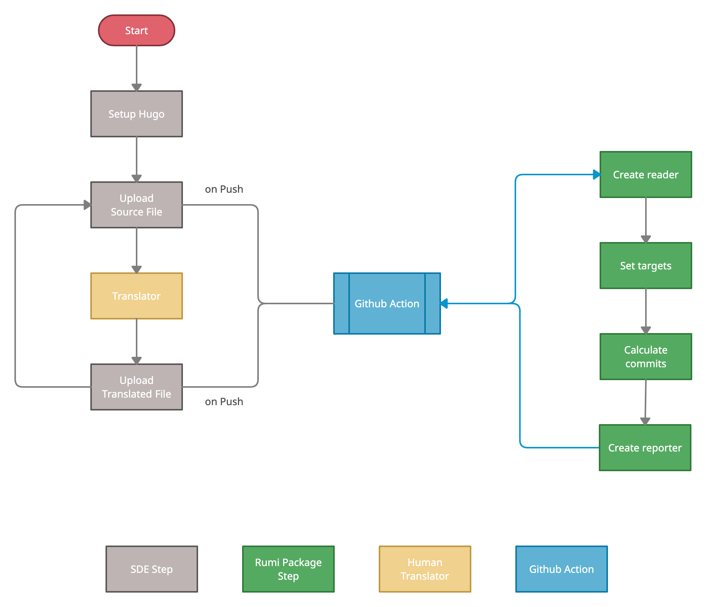
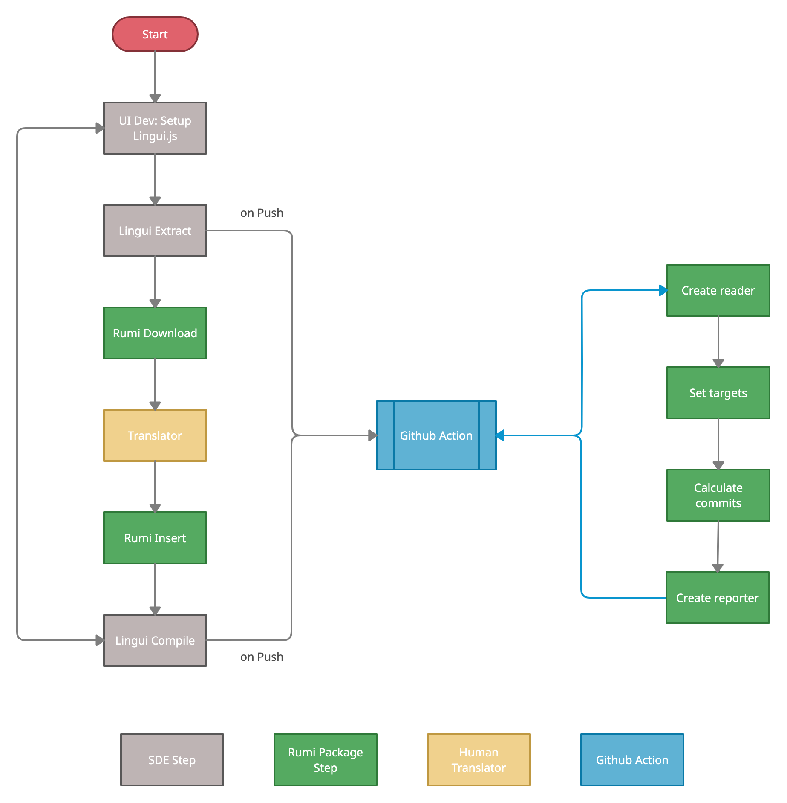

# rumi

> Not the ones speaking the same language, but the ones sharing the same feeling understand each other.   &mdash;Rumi

Rumi is a static site translation monitoring tool designed to support the localization (l10n) and internationalization (i18n) of documentation, and to facilitation the long-term maintenance of translated documentation.

Rumi currently supports two workflows for translation monitoring: file-based monitoring and message-based monitoring, both of which are described below.

## File-based Translation Monitoring Workflow

**File-based translation flow exemplified with Hugo site**


### 1. Create reader

```python
reader = FileReader(
        repo_path=".",
        branch="main",
        langs="",
        content_paths=["content"],
        extensions=[".md"],
        pattern="folder/",
        src_lang="en",
        use_cache=True
    )
```

Parameters:

`repo_path`: Path to the repository for translation monitoring.
`branch`: Name of the branch to read the github history from.
`content_paths`: List of paths from the root of the repository to the directory that contains contents for translation, e.g., ["content", "data", "i18n"].  
`extensions`: List of extensions of the target files for translation monitoring.  
`pattern`: Two types of patterns in which the static site repository is organized: "folder (organizing contents from each locale into one folder of the locale name, e.g. en/filename.md, fr/filename.md) and ".lang" (organizing contents from each locale by tagging the file name with the locale name, e.g. filename.en.md, filename.fr.md)
`langs`: Language codes joint by a white space as specified by the user. If not specified, FileReader will try to get languages from the filenames in the current repository for monitoring.
`src_lang`: Default source language set by user.
`use_cache`: Whether to use cached commit history datastructure.

### 2. Set targets

The target files for translation monitoring are initialized using `content_paths` and `extensions`, and it can also be specified by adding or deleting single filename.

```python
reader.add_target(filename)
reader.del_target(filename)
```

### 3. Calculate commits

```python
commits = reader.parse_history()       # Structured commit history
```

### 4. Create reporter

```python
reporter = FileReporter(
    repo_path=reader.repo_path,
    src_lang=detail_src_lang,
    tgt_lang=detail_tgt_lang
)
```

`src_lang`: Language code of the source language (the original language of contents) to be reported. If not specified, all source language will be reported.
`tgt_lang`: Language code of the target language (language to translate contents
into) to be reported. If not specified, all target language will be reported.

### 5. Report stats and details

stats mode: displays the number of Open (hasn't been translated), Updated (source file has been updated after translation), Completed (source file has been translated for all target languages). E.g.:

```python
stats = reporter.get_stats(commits)
reporter.print_stats(stats)

"""
    | Target Language   |   Total |   Open |   Updated |   Completed |
    |-------------------+---------+--------+-----------+-------------|
    | fr                |       0 |      0 |         0 |           0 |
    | en                |       1 |      0 |         0 |           1 |
    | zh                |       1 |      0 |         1 |           0 |
    | ja                |       1 |      1 |         0 |           0 |
"""
```

detail mode: displays translation work required for each target file together with more details. E.g.:

```python
details = reporter.get_details(commits)
reporter.print_details(details)

"""
| File    | Status    | Source Language | Word Count | Target Language | Percent Completed | Percent Updated |
|---------+-----------+-----------------+------------+-----------------+-------------------+-----------------|
| file.md | completed | fr              |          4 | en              | 100.0%            | 0%              |
| file.md | updated   | fr              |          4 | zh              | 50.0%             | 50.0%           |
| file.md | open      | fr              |          4 | ja              | 0%                | 100.0%          |
"""
```

Here `Word Count` reports number of words in the source file. `Percent Completed` is estimated by number of lines in the translation file divided by that in the source file. `Percent Updated` is number of lines inserted in the source file since the latest edit of the translation file.

### 6. Additional resources for the SDE steps

For more about setting up a Hugo site, check out the documentation about [Hugo in multilingual mode](https://gohugo.io/content-management/multilingual/).


## Message-based Translation Monitoring Workflow

**Message-based translation flow exemplified with React App**


### 1. Create reader

```python
reader = MsgReader(
    repo_path=".",
    branch="main",
    content_paths=["content"],
    extensions=[".po"],
    src_lang="en",
    use_cache=True
    )
```

### 2. Set targets

```python
reader.add_target(filename)
reader.del_target(filename)
```

### 3. Calculate commits

```python
commits = reader.parse_history()
```

### 4. Create reporter

```python
reporter = MsgReporter()
```

### 5. Report stats and details

stats mode: Print out a summary of the translation.

```python
stats = reporter.get_stats(commits, src_lang)
reporter.print_stats(stats)

"""
    | Language   |   Total |   Open |   Updated |   Completed |
    |------------+---------+--------+-----------+-------------|
    | en         |       2 |      0 |         0 |           0 |
    | fr         |       2 |      1 |         1 |           0 |
    | ja         |       2 |      0 |         1 |           1 |
"""
```

detail mode: Print out the details of messages needing translations for each language and provide word count.

```python
details = reporter.get_details(commits, src_lang)
reporter.print_details(details)

"""
    ----------------------------------------------------------------------
    ja Open: 2
    msgid1
    msgid2
    ----------------------------------------------------------------------
    zh Open: 0
    ----------------------------------------------------------------------
    de Open: 0
    ----------------------------------------------------------------------
    fr Open: 1
    msgid1
    ----------------------------------------------------------------------
    en Open: 0
    ----------------------------------------------------------------------
"""
```

### 6. Rumi Download

Rumi can help you download the new messages from `Lingui Extract` results:

```python
reporter.download_needs(details, lang, path=".")
```

### 7. Rumi Insert Translated

Rumi can also insert the new translations back into the old ones, to support the next `Lingui Compile` step.

```python
reporter.insert_translations("new_translations.txt", "old_messages.po")

```

### 8. Additional Resources for the SDE steps

Here are some additional resources for getting set up with Lingui on your React project:
  - UI Dev: Setup Lingui.js
    - Installation: [Setup Lingui with React project](https://lingui.js.org/tutorials/setup-react.html)
    - Wrap Messages: Wrap UI text message according to [Lingui patterns](https://lingui.js.org/tutorials/react-patterns.html)
  - Lingui Extract: `npm run extract` or `yarn extract`
  - Lingui Compile: `npm run compile` or `yarn compile`

## Github Action


```yaml
name: Rumi translation monitoring
on: push

jobs:
  rumi:
    runs-on: ubuntu-latest
    steps:
      - name: Clone target repository
        run: |
          git clone [url of the target repository]

      - name: Run Action 
        uses: tl6kk/rumi_action@main # to be changed after rumi publication
        with: 
          which_rumi: "file" # "file" for file-based or "msg" for message-based
          repo_path: "path_to_repo"
          branch: "main"
          content_paths: "content1, content2, content3"
          extensions: ".md, .txt"
          target_files: "target1, target2, target3"
          pattern: "folder/"  # "folder/" or ".lang" depending on the setup of file-based project
          langs: "en fr zh ja" # You can specify the languages to monitor with language codes
          src_lang: "en"
          detail_src_lang: ""
          detail_tgt_lang: ""
          stats_mode: "True"
          details_mode: "True"
          use_cache: "True"
``` 